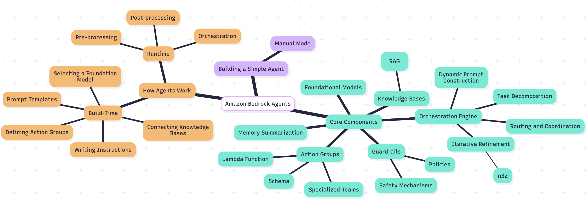

# Level 5 Agent - NotebookLM Clone

This project contains a Bedrock agent named **NotebookLM Clone**. The agent is designed to mimic the functionality of Google NotebookLM by implementing a multi-agent, multi-tool system.

## Overview

- **Agent Name**: NotebookLM Clone
- **Description**: A multi-agent system capable of ingesting files, YouTube videos, and webpages, and performing advanced tasks such as answering questions, generating mind maps, and creating audio podcasts.
- **Foundation Model**: Amazon Nova Pro v1

## Key Features
- This agent demonstrates advanced multi-agent and multi-tool capabilities.
- Ingests various types of content, including files, YouTube videos, and webpages.
- Answers simple questions based on ingested information.
- Generates mind maps for user questions or topics.
- Creates 2-person audio podcasts for user questions or topics.
- Utilizes multiple agents and tools for task execution.

## How to Use

1. Test the agent using the Bedrock console or API.
2. Provide input in the form of files, YouTube links, or webpage URLs.
3. Interact with the agent by asking questions or requesting specific outputs (e.g., mind maps or audio podcasts).
4. The agent will process the input and provide the requested output using its multi-tool capabilities.

## Outputs

Below are some example outputs generated by the agent:

### Mind Map

### Podcast
The agent can generate a 2-person audio podcast. You can listen to an example [here](outputs/final_podcast.mp3).

