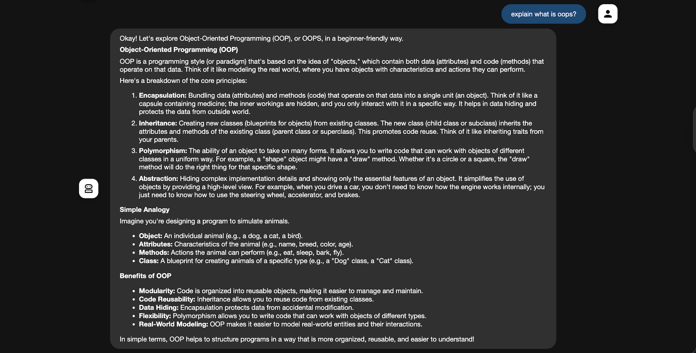
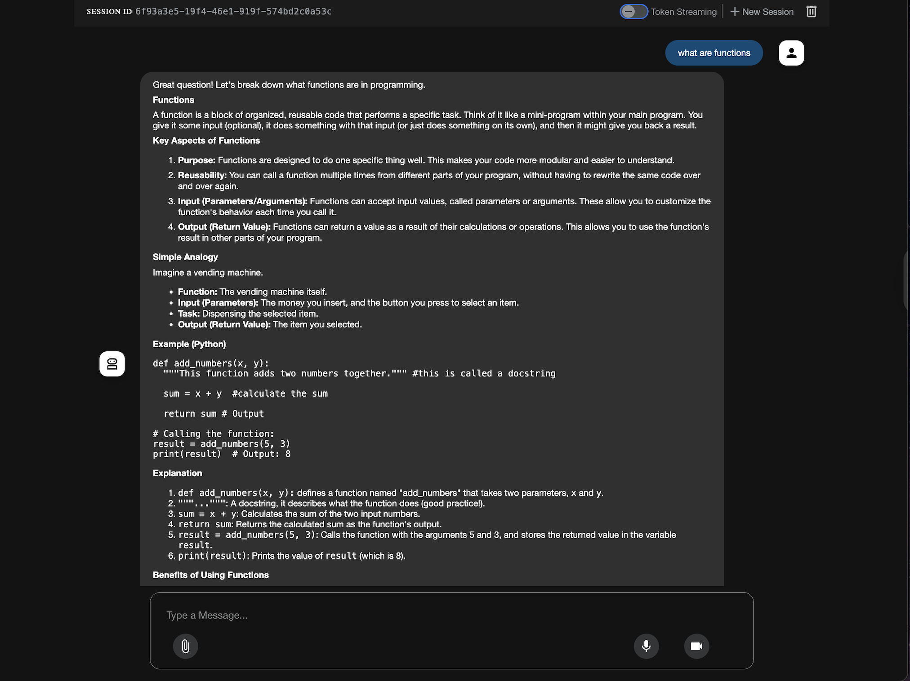

## 🌟 Hello_World Agent - A start to ADK


##  Overview

This is a simple, beginner-friendly **agent** built using **Google's Agent Development Kit (ADK)** and powered by **Gemini 2.0**. Ideal for quick experimentation and as a starting point for building a simple hello_world agent.

For example , you're curious about **functions, object-oriented programming (OOPS)**, or **data structures**, this agent is designed to help in a friendly, accessible way .

Refer to the sample problem : [Problem Statement](https://github.com/cladius/agentic-ai/blob/master/sample_problem.md)

---

## 📌 What Is been built


✅ Tailored responses for **beginner programmers**

✅ No external tools — pure model knowledge

✅ Powered by **Gemini 2.0 Flash** model via Google ADK


---

## 📚 Example Questions to Ask

* What is a function in Python?
* What is artificial intelligence?
* Which are the good IT companies?


---

## 🛠️ Tech Stack

| Tool/Library          | Purpose                                  |
| --------------------- | ---------------------------------------- |
| `google-adk`          | Agent orchestration and interaction      |
| `google-generativeai` | Gemini model integration                 |


---

## ⚙️ How It Works

1. Loads your `GOOGLE_API_KEY` from a `.env` file.
([Generate Google API Key](https://aistudio.google.com/apikey))

2. Defines a **root agent** with instructions to  answer **programming-related questions**.
3. Starts an **interactive command-line chat interface**.
4. Uses **stateless session** per query — no memory of previous questions.


---

## 🧠 Agent Behavior

The agent is **instruction-guided** with the following traits:

* Always explains topics **clearly and concisely**
* Tailors answers to **beginners** with **simple examples**

* Uses **Gemini 2.0 Flash** model (fast and capable)

---


---

### 4️⃣ Set Up Your `.env` File

Create a `.env` file in the root directory:

```env
GOOGLE_API_KEY=your_google_api_key
```

---

## 🚀 How to Run

Launch the agent from the terminal:

```bash
python agent.py
```

Launch the agent on interface:

```bash
python adk web
```


---

| |




From this project you can learn :

* Learning **how to use Google ADK** and build intelligent agents
* Understanding **agent architecture**


---

---

## 📎 Resources

* [🧠 Gemini Docs](https://ai.google.dev/)
* [🧰 Google ADK Documentation](https://cloud.google.com/agent-development/docs)


---
