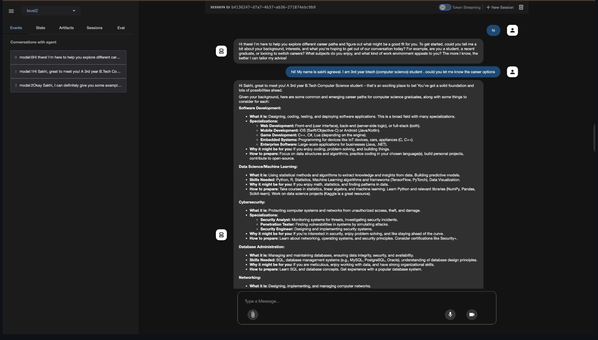
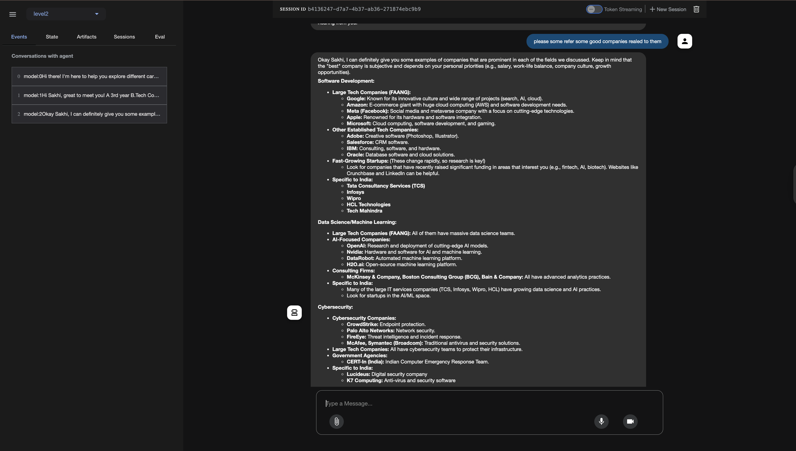

# Career Advisor Agent — With Conversational Memory

This project solves **Level 2: Conversational Memory** from Google’s ADK learning path.


Built as a **beginner-friendly example** for learning how to use memory in agents.

---

## 📘 What is This ?

This is a **Career Advisor Agent** — a terminal-based AI assistant built with **Google's Agent Development Kit (ADK)**.

Forexample, it **remembers your name, interests, and background** during a session and uses that memory to offer **personalized career guidance**, **textbook recommendations**, and **job suggestions**.

It demonstrates **how to add conversational memory** to a large language model (LLM) agent — a key challenge because LLMs are **stateless by default**.

---

## 🎯 Use Case: Career Counseling with Context Awareness

> Example: You say, “Hi, I’m Alice, interested in compiler design and ML.”
> The agent remembers your name and interests and tailors follow-up responses based on that.

---

## ✨ Features

* 🧠 **Conversational Memory**: Remembers user name, background, and interests within a session.
* 😊 **Friendly Chat**: Talks like a career counselor — polite, engaging, and helpful.
* 📚 **Resource Recommender**: Suggests textbooks and learning materials.
* 💼 **Career Guide**: Recommends roles based on user input (e.g., ML Engineer, Compiler Developer).
* 🔄 **Session Persistence**: Powered by `InMemorySessionService` in ADK.
* ⚙️ **No External Tools**: Works using model knowledge only — simple and lightweight.

---


### 3️⃣ Set Up Environment Variables

Create a `.env` file in the root directory:

```env
GOOGLE_API_KEY=your-google-api-key
```

🔑 [Get your Google API key here](https://aistudio.google.com/apikey)

---

--------------------------------------------------------------------------

## 🚀 Run the Agent (Terminal)

```bash
python agent.py
```

---

## 🌐 Run with ADK Web (Optional UI)

If you want to launch the agent in a web interface:

```bash
python adk web
```

> ℹ️ Make sure you run this from the **parent folder** 


-------------------------------------------------------------------------

## Interact with the Agent:


Example Interaction:

Career Advisor Agent is running. Type 'exit' to quit.
Introduce yourself and ask about career options!

You: Hi, I'm Alice, interested in compiler design and ML.

Agent: Nice to meet you, Alice! Your interests in compiler design and machine learning open up exciting career paths...

You: What textbooks should I read?

Agent: For compiler design, I recommend the Dragon Book. For ML, try Deep Learning by Goodfellow...


---

## 🧠 Behind the Scenes: How Memory Works

* Uses `InMemorySessionService` from ADK to store session context
* Each user session retains name, interests, and prior inputs
* The agent’s responses evolve based on your earlier messages
* When the session ends or resets, memory is cleared (stateless again)

---






## 📚 Helpful Resources

* [🧠 Gemini Model Docs](https://ai.google.dev/)
* [🛠 Google ADK Documentation](https://cloud.google.com/agent-development/docs)
* [📜 ADK Sample Problem: Level 2 - Memory](https://github.com/cladius/agentic-ai/blob/master/sample_problem.md)
* [🌐 API Key Generator](https://aistudio.google.com/apikey)

---

