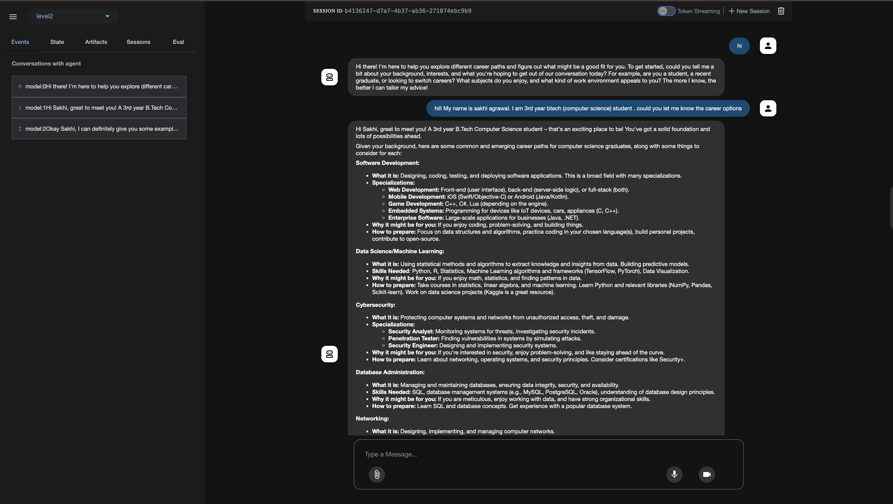

# Career Advisor Agent 🌟

## Overview 📖

Welcome to the Career Advisor Agent! This Python-based application leverages Google's Agent Development Kit (ADK) to create a conversational AI that guides users through career exploration. Powered by the gemini-2.0-flash model, the agent remembers user details (like name, interests, and background) to provide personalized career advice, recommend specific textbooks, and suggest job roles. It's like having a career counselor in your terminal! 🚀
Features ✨

Personalized Advice: Remembers user details to tailor career recommendations. 🧠

Conversational & Friendly: Engages users by name and maintains a warm tone. 😊

Resource Recommendations: Suggests specific textbooks and learning resources tied to user interests. 📚

Persistent Sessions: Maintains conversation history for a seamless experience. 🔄

No External Tools: Relies on the agent's knowledge for lightweight operation. ⚙️
--------------------------------------------------------------------------

## Prerequisites 🛠️

Python: Version 3.8 or higher.

Google ADK: Install the Google Agent Development Kit and related libraries.

Google API Key: A valid API key for the gemini-2.0-flash model.

## Dependencies:

python-dotenv: For secure environment variable management.

google-adk: For agent and session management.

google-genai: For interacting with Google's generative AI models.

-------------------------------------------------------------------------

## Installation ⚙️

Install Dependencies:

pip install python-dotenv google-adk google-genai

Configure Environment Variables:

Create a .env file in the project root.

Add your Google API key:GOOGLE_API_KEY=your-api-key-here

-------------------------------------------------------------------------

## Usage 🚀

Run the Application:

python main.py

-------------------------------------------------------------------------

## Interact with the Agent:

The program prompts with You: .

Introduce yourself (e.g., "Hi, I'm Alice, interested in compiler design and ML") and ask about career options.

Follow up with questions like "What textbooks should I read?" or "What job roles suit me?".

Type exit to quit.

Example Interaction:
Career Advisor Agent is running. Type 'exit' to quit.

Introduce yourself and ask about career options!

--- Example conversation: ---
You could tell the agent about yourself and ask 'What are some good career options?'

Then follow up with: 'What are some relevant textbooks that align with my interests?'

--- End example ---

You: Hi, I'm Alice, interested in compiler design and ML.

>>> You: Hi, I'm Alice, interested in compiler design and ML.
>>>
>>> 
<<< Agent: Nice to meet you, Alice! Your interests in compiler design and machine learning open up exciting career paths. For compiler design, you could explore roles like Compiler Engineer or Systems Software Developer. For ML, consider Machine Learning Engineer or Data Scientist. Would you like specific job role details or learning resources to get started?
You: What textbooks should I read?

>>> You: What textbooks should I read?
>>>
>>> 
<<< Agent: For compiler design, Alice, I recommend *Compilers: Principles, Techniques, and Tools* by Aho, Sethi, and Ullman—it's the 'Dragon Book' and a classic for understanding compiler construction. For ML, *Deep Learning* by Goodfellow, Bengio, and Courville is great for diving into neural networks, which aligns with your interests. Want more resources or details on these?
You: exit

Goodbye!

Notes 📌

to run the agent using adk web make sure to run the command in the parent folder

