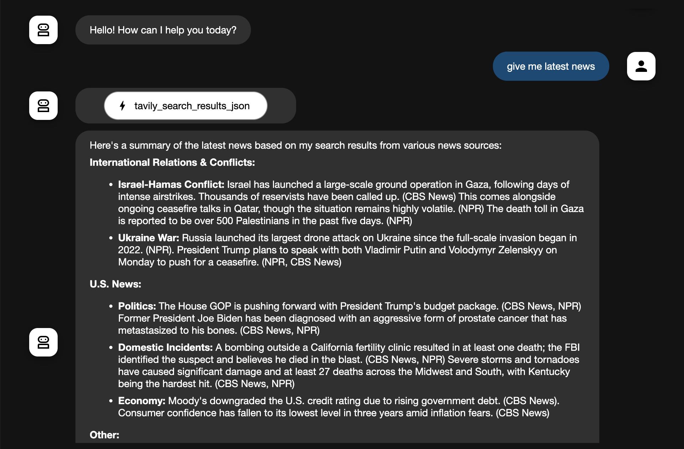

---

# News Agent – Powered by Tools & Google ADK


---


It’s built for  learning how to make LLMs "see the world" by integrating **external tools** like search.
The **News Agent ** is an intelligent Python assistant that fetches the **latest news articles** and provides **concise summaries** . 


---

## 🔧 What Problem Are We Solving?

LLMs (like Gemini or GPT) **do not have real-world awareness** by default.
They can’t:

* Access fresh news
* Check current prices
* Look up latest events

This project demonstrates how to **equip an LLM agent with a web search tool** 

## ✨ Features

| Feature                        | Description                                                        |
| ------------------------------ | ------------------------------------------------------------------ |
| 🔍 **Web Search Tool**         | Queries for fresh news articles                                    |
| 🧠 **LLM + Tools Integration** | Combines Gemini’s intelligence with real-world search              |
| 🔁 **Interactive Chat**        | Ask multiple questions in a loop or run a single-shot query        |
| 🔒 **Secure Environment**      | Loads API keys securely with dotenv                                |
| ⚙️ **Easy to Extend**          | Add more tools (e.g., weather, finance, databases)                 |

---

## 📦 Prerequisites


* **Tavily API key** → [Get one here](https://app.tavily.com/)
* **Google API key** → [Generate here](https://aistudio.google.com/apikey)

---

### 2️⃣ Create a `.env` File

In the project root, create `.env`:

```env
TAVILY_API_KEY=your-tavily-api-key
GOOGLE_API_KEY=your-google-api-key
```

---

## 🚀 Running the Agent


---

Run the script:

```bash
python3 agent.py
```

 Run the script in web:

```bash
python3 adk web
```


📌 Now ask anything like:

* *“What are the latest US tariffs on China?”*
* *“How is the EU responding to US tariffs?”*
* Type `exit` to quit

---

## 🧠 How It Works (Tool-Driven Agent)

1. **User inputs query**
2. **Tool** fetches the latest web articles
3. **LLM (Gemini or similar)** summarizes the findings
4. **Agent responds** with up-to-date, factual info

✅ This is **LLM + Search = Intelligent Assistant**

---

## 🧪 Example Output

```bash
News Agent is running. Type 'exit' to quit.

You: What is the latest on US tariffs?

<<< Agent:
According to Reuters, the US imposed a 25% tariff on $200 billion of Chinese goods in 2024.
Talks with the EU are scheduled for December 2025. Consumer prices rose by 10%.
```




Custom Instructions: Modify the instruction in root_agent for different topics or response styles.

---

## 🐞 Troubleshooting

| Issue                                          | Solution                                     |
| ---------------------------------------------- | -------------------------------------------- |
| `KeyError: GOOGLE_API_KEY` or `TAVILY_API_KEY` | Ensure `.env` file is present and valid      |

---


This is a **real-world, entry-level example** of how to:

* Use **Google ADK** to build intelligent agents
* Add **web search tools** to agents
* Create **conversational systems that are aware of current events**


---

## 📚 Resources

* [🧠 Google ADK Docs](https://cloud.google.com/agent-development/docs)
* [🔍 Tavily Tool Docs](https://docs.tavily.com/)
* [🧩 LangChain Tools](https://docs.langchain.com/docs/integrations/tools/)
* [📜 Problem Statement: Tools (Level 3)](https://github.com/cladius/agentic-ai/blob/master/sample_problem.md)


---
## 📚 API key

* [🗝 Generate Google API Key](https://aistudio.google.com/apikey)

