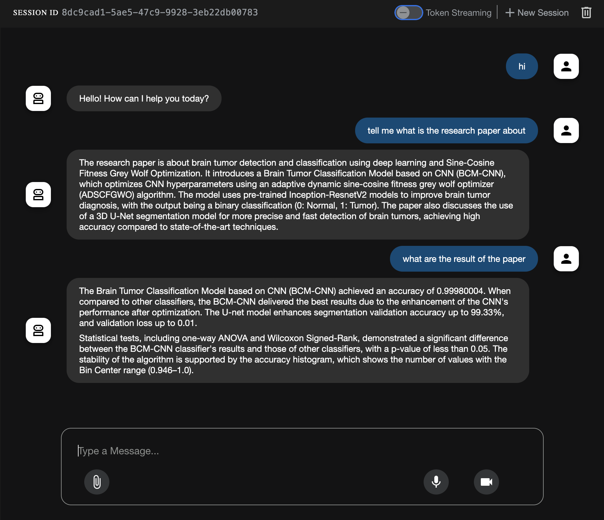

---

# 🤖 Vertex AI RAG Agent with Google ADK


---


This project demonstrates how to **deploy a RAG-based intelligent agent** using:

* **Google’s Agent Development Kit (ADK)**
* **Vertex AI Search Corpus** as the **vector store**
* **Gemini model** for natural language generation
* **PDF and link-based document ingestion** for custom knowledge grounding

All answers are **retrieved from your own documents**, not the public web.

---

## 🧠 Why This Matters 

LLMs **cannot access proprietary documents** unless you give them context.

This project solves that by:

✅ Creating a **custom RAG corpus** using Vertex AI.

To use Retrieval-Augmented Generation (RAG) with Vertex AI, you first need to create a Vertex AI Search corpus and ingest your documents (PDFs, URLs, etc.) into it.Create a Vertex AI Search App  ([ 🔗 Vertex AI RAG Overview](https://cloud.google.com/vertex-ai/docs/generative-ai/agent-rag-overview) )

✅ Ingesting documents like **PDFs and webpages**

✅ Deploying a **Google ADK-powered agent** that retrieves and answers questions using the ingested content


> 📚 Ingest proprietary documents like PDFs & websites

> 🔍 Retrieve relevant info using RAG (Retrieval-Augmented Generation)

> 💡 Example: Upload a resume or research paper and ask questions on it!

---


✅ Built a **Google ADK agent** using `gemini-2.0-flash-001`

✅ Connected it with a **Vertex AI RAG corpus**

✅ Enabled the agent to **process PDFs and links** as context

✅ Configured **.env**, retrieval tool, and session memory

✅ Built a **CLI interface** for asking questions about ingested docs

---


## 🚀 Features

| Feature                        | Description                                                    |
| ------------------------------ | -------------------------------------------------------------- |
| 🧠 Vertex AI RAG               | Retrieves document chunks from a private corpus                |
| 💬 Gemini Model (`gemini-2.0`) | Answers grounded questions using retrieved context             |
| 🧾 PDF + URL Support           | Supports ingestion of PDFs and webpages with hyperlinks        |
| 🛠 Modular Agent Tools         | RAG logic is added as a tool (`VertexAiRagRetrieval`)          |
| 🧑‍💻 Terminal Agent Interface | Interactive CLI to ask and receive document-grounded responses |
| 🔁 Stateless/Session Support   | Session memory using `InMemorySessionService`                  |

---

---

### 2️⃣ Environment Setup

Create a `.env` file:

```env
GOOGLE_API_KEY=your_gemini_api_key
RAG_CORPUS=your_vertex_ai_corpus_id
```

---


---

## 💬 How It Works

1. **Loads your Gemini API key and RAG corpus ID**
2. **Creates a retrieval tool using `VertexAiRagRetrieval`**
3. **Initializes a Gemini-based agent with the tool**
4. **Maintains short session memory using ADK**
5. **Streams answers to your questions using retrieved data**

---

## 🧪 Run the Agent

```bash
python agent.py
```

## 🧪 Run the Agent on web

```bash
python adk web
```


---

## 🛠️ Troubleshooting

| Issue                      | Solution                                                   |
| -------------------------- | ---------------------------------------------------------- |
| `GOOGLE_API_KEY not found` | Ensure `.env` is created with valid API key                |
| `Corpus not found`         | Check `RAG_CORPUS` ID in Vertex AI                         |
| `Empty response`           | Make sure your corpus has ingested documents properly      |
| `Session resets each time` | Default behavior; switch to persistent store in production |

---
ß

---

## 🧠 Example Use Case

> 🔍 I uploaded a research paper on **Brain Tumor Detection using Deep Learning**, then asked:

> *"What is the architecture of the model used?"*
> *"What dataset is used in this paper?"*

📋 The agent answered with grounded, accurate responses pulled from the PDF chunks ingested in Vertex AI.




---

## 📚 Resources

* [🔗 Google ADK Docs](https://cloud.google.com/agent-development/docs)
* [🔗 Vertex AI RAG Overview](https://cloud.google.com/vertex-ai/docs/generative-ai/agent-rag-overview)
* [🔗 Google AI Studio (Gemini API)](https://aistudio.google.com/apikey)
* [📄 Problem Statement: Level 4 – Vector Store](https://github.com/cladius/agentic-ai/blob/master/sample_problem.md)

---

