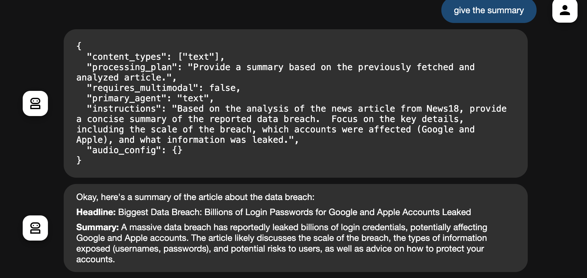
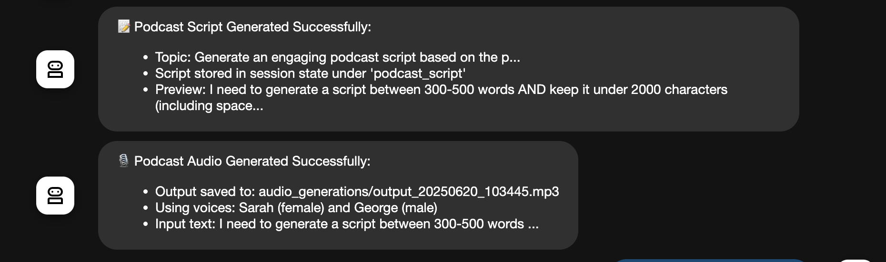

# 🤖 Multimodal AI Agent System

## 🌐 Overview

The **Multimodal AI Agent System** is a powerful Python-based framework that processes and generates diverse content types — including **text**, **audio**, **images**, and **videos**. This project is a  clone of Google’s LM Notebook, customized to demonstrate multimodal capabilities using intelligent agents. It leverages multiple AI agents for:

* 🎙 Podcast script generation
* 🗣 Audio synthesis
* 🖼 Image generation
* 🎧 Real-time audio processing

The system integrates with external APIs such as **Google Generative AI** and **ElevenLabs**, and uses **ChromaDB** for efficient content storage and retrieval.

## 🌟 What Is This Project?

 
The Multimodal AI Agent System is a smart assistant you can run from your computer. It understands and works with text, audio, images, and videos, making it a flexible tool for content generation and analysis.

You can read the original problem statement here:
[Problem statement](https://github.com/cladius/agentic-ai/blob/master/sample_problem.md)

---

## 🚀 Features

* 📝 **Text Processing**: Understands and responds to natural language input.
* 🎙 **Podcast Generation**: Writes scripts and converts them to speech using ElevenLabs.
* 🖼 **Image Generation**: Creates images from text with Google’s Gemini model.
* 🔊 **Audio Processing**: Supports file-based and real-time audio analysis.
* 🔗 **Link Processing**: Extracts content (text/images/PDF) from URLs into ChromaDB.
* 💻 **Interactive CLI**: Powerful terminal interface with special commands.

---

## 📦 Prerequisites

* **Python**: 3.8+
* **Dependencies**:
  Install using:

  ```bash
  pip install -r requirements.txt
  ```


---

## 🔐 API Keys

Create a `.env` file in the root directory:

```env
GOOGLE_API_KEY=your_google_api_key  
ELEVENLABS_API_KEY=your_elevenlabs_api_key
```
🔑 Get your API keys here:

🔹 [Generate your Google API Key](https://aistudio.google.com/apikey)

🔸 [ElevenLabs API Key](https://elevenlabs.io/app/settings/api-keys)

---


Ensure **FFmpeg** is installed for audio processing:

* macOS: `brew install ffmpeg`
* Linux: `sudo apt-get install ffmpeg`

* windows: download from here   🔗 https://ffmpeg.org/download.html


---

## 💬 Usage

Start the CLI interface:

```bash
python agent.py
```
To run on web interface

```bash
python adk web
```


### 🤖 Agents

| Agent Name                    | Role                                        |
| ----------------------------- | ------------------------------------------- |
| `MultimodalOrchestratorAgent` | Coordinates tasks across agents             |
| `RouterAgent`                 | Routes tasks to appropriate agents          |
| `TextAnalysisAgent`           | Handles text analysis                       |
| `ImageAnalysisAgent`          | Analyzes image input                        |
| `VideoAnalysisAgent`          | Analyzes video content                      |
| `AudioAnalysisAgent`          | Processes audio files                       |
| `RealtimeAudioAgent`          | Handles live audio streams                  |
| `ScriptGeneratorAgent`        | Creates podcast scripts                     |
| `PodcastGeneratorAgent`       | Converts scripts to speech (Sarah & George) |
| `ImageGenerationAgent`        | Generates images using Gemini               |

### 🛠 Utilities

* `AudioProcessor`: Converts audio for compatibility
* `ChromaDBManager`: Stores and retrieves content
* `LinkProcessor`: Extracts webpage content
* `MultimodalAPI`: External access to agent features

---

## 🧠 Models Used

| Model Name                                | Purpose                      |
| ----------------------------------------- | ---------------------------- |
| Gemini-1.5-Flash                          | Text routing & analysis      |
| Gemini-2.0-Flash-Exp                      | Advanced multimodal analysis |
| Gemini-2.0-Flash-Live-001                 | Real-time audio              |
| Gemini-2.0-Flash-Preview-Image-Generation | Image generation             |
| ElevenLabs Multilingual v2                | Text-to-speech conversion    |

---


* **Output Directories**:

  * Audio: `audio_generations/`
  * Images: `image_generations/`
  * Samples: `audio_samples/`





---

## ⚠️ Error Handling

* All errors logged with timestamps.
* Check for:

  * Missing/invalid API keys
  * Unsupported audio format
  *  Exceeding character limits in podcast scripts (<2000 chars)

---

## 🧪 Limitations

* 📜 Script length: Max 2000 characters


To see the agent in action refer to the video below:

[Demo Video](https://drive.google.com/file/d/1ydevs3OMk1Skn8dXi3tU9BV1G_nbbHWC/view)


---


