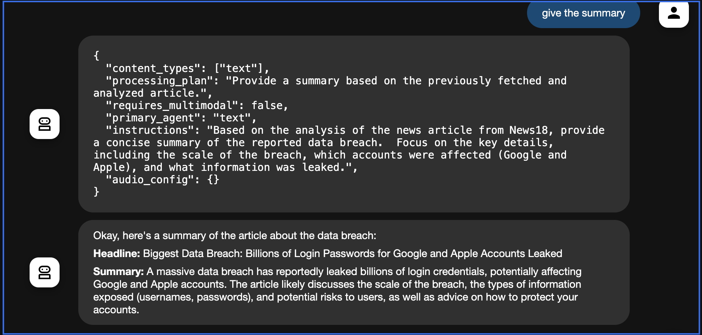
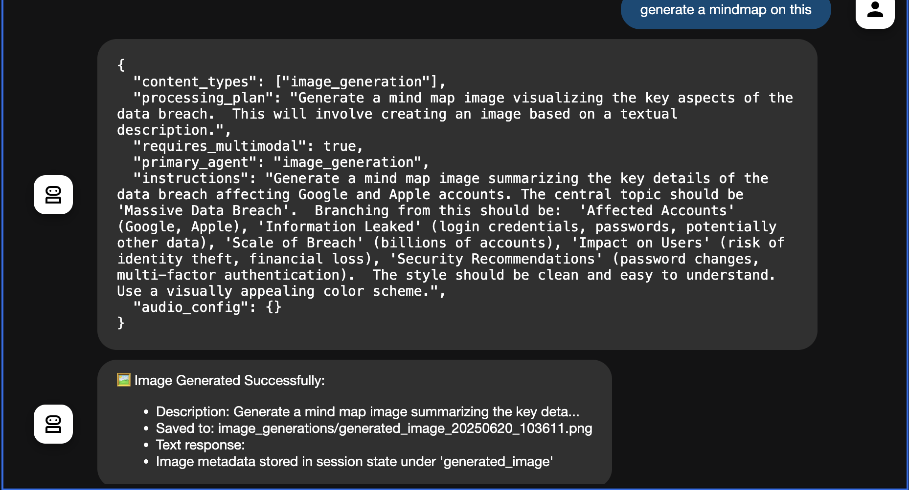
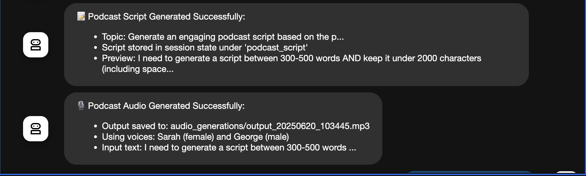

# 🤖 Multimodal AI Agent System

## 🌐 Overview

The **Multimodal AI Agent System** is a powerful Python-based framework that processes and generates diverse content types — including **text**, **audio**, **images**, and **videos**. It leverages multiple AI agents for:

* 🎙 Podcast script generation
* 🗣 Audio synthesis
* 🖼 Image generation
* 🎧 Real-time audio processing

The system integrates with external APIs such as **Google Generative AI** and **ElevenLabs**, and uses **ChromaDB** for efficient content storage and retrieval.

---

## 🚀 Features

* 📝 **Text Processing**: Understands and responds to natural language input.
* 🎙 **Podcast Generation**: Writes scripts and converts them to speech using ElevenLabs.
* 🖼 **Image Generation**: Creates images from text with Google’s Gemini model.
* 🔊 **Audio Processing**: Supports file-based and real-time audio analysis.
* 🔗 **Link Processing**: Extracts content (text/images/PDF) from URLs into ChromaDB.
* 💻 **Interactive CLI**: Powerful terminal interface with special commands.

---

## 📦 Prerequisites

* **Python**: 3.8+
* **Dependencies**:
  Install using:

  ```bash
  pip install -r requirements.txt
  ```

### 🧩 Key Packages

* `google-generativeai`
* `elevenlabs`
* `pydub`, `Pillow`, `chromadb`
* `requests`, `beautifulsoup4`, `python-dotenv`

---

## 🔐 API Keys

Create a `.env` file in the root directory:

```env
GOOGLE_API_KEY=your_google_api_key
ELEVENLABS_API_KEY=your_elevenlabs_api_key
```

---

## 🛠 Installation

```bash
git clone https://github.com/your-repo/multimodal-ai-agent.git
cd multimodal-ai-agent
pip install -r requirements.txt
```

Ensure **FFmpeg** is installed for audio processing:

* macOS: `brew install ffmpeg`
* Linux: `sudo apt-get install ffmpeg`

---

## 💬 Usage

Start the CLI interface:

```bash
python multimodal_agent.py
```

### 💡 Example Commands

| Command                         | Description                                |
| ------------------------------- | ------------------------------------------ |
| `process <url>`                 | Extracts and stores content from a webpage |
| `search <query>`                | Searches stored documents in ChromaDB      |
| `list`                          | Lists all stored documents                 |
| `summary <doc_id1,doc_id2,...>` | Generates a summary from specific docs     |
| `podcast <doc_id1,doc_id2,...>` | Generates a podcast from documents         |
| `image <doc_id1,doc_id2,...>`   | Generates an image from documents          |
| `exit`                          | Exits the interactive session              |

---

## 🔍 Example Interaction

```bash
🤖 Enhanced Multimodal AI Agent System
======================================================================
Available capabilities:
- Text processing and analysis
- Audio file processing
- Real-time audio processing
- Podcast generation
- Podcast script generation
- Image generation
- Link processing and storage
- Data retrieval and analysis
======================================================================

You: Generate a podcast script about AI in healthcare  
🤖 Script Generated and stored: 'podcast_script' ✅

You: process https://example.com  
🤖 Link processed successfully. Document ID: a1b2c3d4 ✅

You: exit  
👋 Goodbye!
```

---

## 🧩 System Components

### 🤖 Agents

| Agent Name                    | Role                                        |
| ----------------------------- | ------------------------------------------- |
| `MultimodalOrchestratorAgent` | Coordinates tasks across agents             |
| `RouterAgent`                 | Routes tasks to appropriate agents          |
| `TextAnalysisAgent`           | Handles text analysis                       |
| `ImageAnalysisAgent`          | Analyzes image input                        |
| `VideoAnalysisAgent`          | Analyzes video content                      |
| `AudioAnalysisAgent`          | Processes audio files                       |
| `RealtimeAudioAgent`          | Handles live audio streams                  |
| `ScriptGeneratorAgent`        | Creates podcast scripts                     |
| `PodcastGeneratorAgent`       | Converts scripts to speech (Sarah & George) |
| `ImageGenerationAgent`        | Generates images using Gemini               |

### 🛠 Utilities

* `AudioProcessor`: Converts audio for compatibility
* `ChromaDBManager`: Stores and retrieves content
* `LinkProcessor`: Extracts webpage content
* `MultimodalAPI`: External access to agent features

---

## 🧠 Models Used

| Model Name                                | Purpose                      |
| ----------------------------------------- | ---------------------------- |
| Gemini-1.5-Flash                          | Text routing & analysis      |
| Gemini-2.0-Flash-Exp                      | Advanced multimodal analysis |
| Gemini-2.0-Flash-Live-001                 | Real-time audio              |
| Gemini-2.0-Flash-Preview-Image-Generation | Image generation             |
| ElevenLabs Multilingual v2                | Text-to-speech conversion    |

---

## ⚙️ Configuration

* **Environment Variables**: Set via `.env`

* **Audio Settings**:

  * Sample Rate: `16kHz`
  * Bit Depth: `16-bit`
  * Channels: `Mono`

* **Output Directories**:

  * Audio: `audio_generations/`
  * Images: `image_generations/`
  * Samples: `audio_samples/`





---

## ⚠️ Error Handling

* All errors logged with timestamps.
* Check for:

  * ❌ Missing/invalid API keys
  * ❌ Unsupported audio format
  * ❌ Exceeding character limits in podcast scripts (<2000 chars)

---

## 🧪 Limitations

* 📜 Script length: Max 2000 characters
* 🎞 Video: Only URL-based analysis
* 🎧 Real-time audio: Simulated, not live-streamed
* 🌐 Requires active internet and valid APIs

---

## 🤝 Contributing

We welcome contributions!

1. Fork the repo
2. Create a branch: `git checkout -b feature/YourFeature`
3. Commit: `git commit -m 'Add YourFeature'`
4. Push: `git push origin feature/YourFeature`
5. Open a pull request 🔁

---

