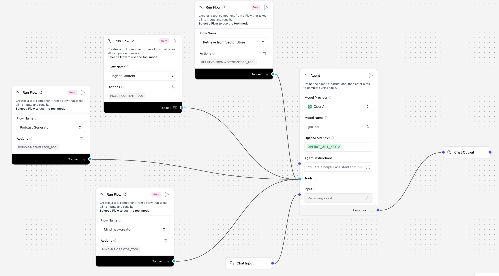
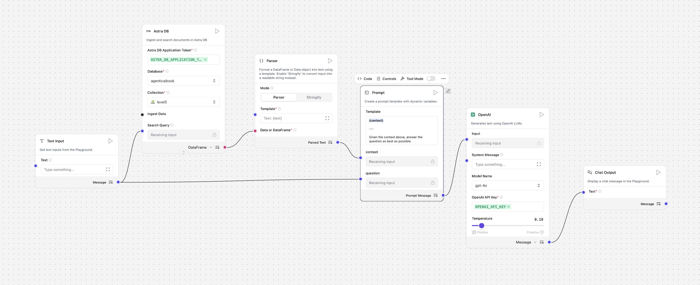
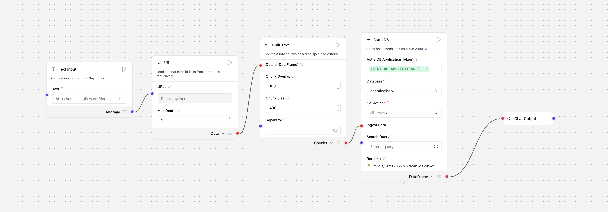
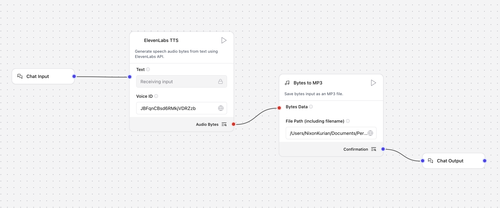
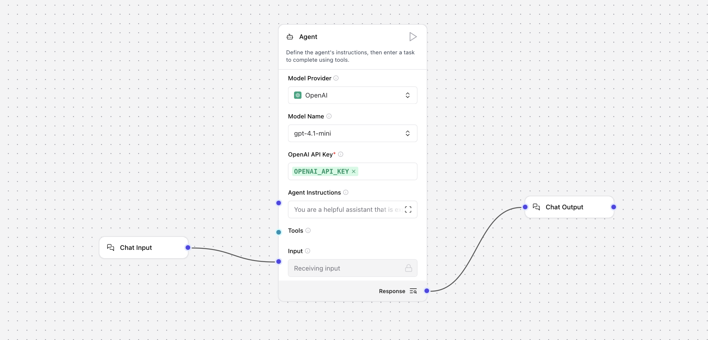

# Level 5 Langflow Flows: Agentic AI Book

This folder contains advanced Langflow flows designed for agentic AI use cases, as part of the Agentic AI Book project. Each flow is modular and can be used as a standalone tool or orchestrated together via the central `MainFlow.json` agent. Below is an in-depth overview of each flow and how they work together.

---

## MainFlow.json
**Purpose:** Central agent orchestration. Exposes multiple tool flows as agent tools, allowing the agent to select and use them based on user intent.

- **Agent Node:** Uses an LLM (default: OpenAI) with a detailed system prompt instructing it to use the right tool for each user request.
- **Tools Exposed:**
  - `Retrieve-from-Vector-Store_tool` (RAG Q&A)
  - `Ingest-Content_tool` (webpage ingestion)
  - `Podcast-Generator_tool` (podcast audio generation)
  - `Mindmap-creator_tool` (mindmap creation)
- **How it works:**
  - User input is routed to the agent.
  - The agent decides, based on the system prompt and user query, which tool to invoke.
  - Each tool is a separate Langflow flow, wired in via RunFlow nodes in tool mode.

Below is a visual overview of the MainFlow orchestration:




---

## Retrieve from Vector Store.json
**Purpose:** Retrieval-Augmented Generation (RAG) Q&A.

- **Pipeline:**
  - Accepts a user query.
  - Uses AstraDB as a vector store to retrieve relevant context.
  - Applies a prompt template to combine the query and context.
  - Passes the prompt to an OpenAI LLM for answer generation.
  - Outputs the answer via a chat output node.
- **Use Case:** When the agent needs to answer questions based on ingested or external knowledge.

Below is the visual overview of the Flow:


---

## Ingest Content.json
**Purpose:** Ingests content from a webpage into the vector store for later retrieval.

- **Pipeline:**
  - Loads content from a user-specified URL.
  - Splits the text into manageable chunks.
  - Ingests the chunks into AstraDB as vector embeddings.
  - Confirms ingestion completion.
- **Use Case:** When the agent is asked to "ingest" or "add" new content for future Q&A.

Below is the visual overview of the Flow:



---

## Podcast Generator.json
**Purpose:** Generates a podcast audio file from text.

- **Pipeline:**
  - Accepts text input.
  - Uses ElevenLabs TTS to generate audio bytes. (custom component)
  - Saves the audio as an MP3 file. (custom component)
  - Outputs a confirmation message with the file location.
- **Use Case:** When the agent is asked to "create a podcast" or "generate audio" from text.

Below is the visual overview of the Flow:



---

## Mindmap-creator.json
**Purpose:** Creates a mindmap in mermaid format based on provided context and topic.

- **Pipeline:**
  - Accepts user input (topic/context).
  - Uses an LLM with a system prompt focused on mindmap generation.
  - Outputs a mindmap in mermaid syntax.
- **Use Case:** When the agent is asked to "create a mindmap" or visualize information.

Below is the visual overview of the Flow:



---

## How These Flows Work Together
- All flows are designed to be modular and reusable.
- `MainFlow.json` acts as the central agent, exposing the other flows as tools.
- The agent's system prompt in `MainFlow.json` instructs it to use the correct tool based on user intent (e.g., ingestion, Q&A, podcast, mindmap).
- Each tool flow can also be run independently for testing or development.

---

## Getting Started
1. Open the desired flow in Langflow Desktop (v1.4.22+ recommended).
2. Configure any required API keys (OpenAI, AstraDB, ElevenLabs, etc.) in the agent or tool nodes.
3. Use `MainFlow.json` for a unified agent experience, or run individual flows for specific tasks.

---

## Sample Usage

Below is a sample workflow demonstrating how to use the Level 5 agentic flows for ingestion, Q&A, and podcast generation:

### 1. Ingest Content
```
Ingest the following - https://cladiusfernando.com/excellence/
```
This command instructs the agent to fetch and ingest the content from the provided URL into the vector store for future retrieval.

### 2. Ask a Question and Generate a Podcast
```
what is the book Excellence about? create a short podcast for it
```
The agent will:
- Retrieve relevant information about the book "Excellence" from the ingested content using the RAG flow.
- Generate a podcast audio summary using the Podcast Generator tool.

### 3. Podcast Output
The generated podcast audio will be saved as an MP3 file. You can find a sample output here:

[▶️ Listen to Sample Podcast Output](output/final_output.mp3)


---

## Notes
- All flows use standard Langflow node types and wiring conventions.
- API keys and credentials are required for LLM and vector store access.
- For more details, see the comments and system prompts inside each flow JSON.

---

For questions or contributions, please refer to the main project README or contact the maintainers.
