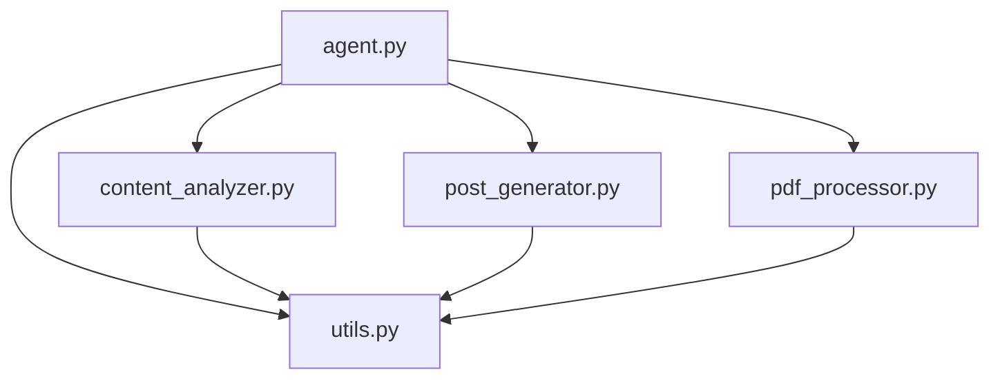

# Design Document

## Overview

The agent refactoring will transform the monolithic `agent.py` file into a modular architecture with separate modules for different functionalities. This design maintains backward compatibility while improving code organization, maintainability, and testability.

## Architecture

The refactored system will follow a modular architecture pattern:

```
agent.py (orchestrator)
├── pdf_processor.py (PDF operations)
├── content_analyzer.py (AI analysis)
├── post_generator.py (social media generation)
└── utils.py (shared utilities)
```

### Module Dependencies



## Components and Interfaces

### 1. PDF Processor Module (`pdf_processor.py`)

**Purpose:** Handle all PDF-related operations including text extraction and page processing.

**Exports:**
- `pdf_processor(start_page: Optional[int], file_path: str) -> Dict`

**Dependencies:**
- PyPDF2
- os, random
- utils.py (for common validation)

**Key Features:**
- Random page selection
- Text extraction with error handling
- Page range validation
- Comprehensive error reporting

### 2. Content Analyzer Module (`content_analyzer.py`)

**Purpose:** Analyze text content using AWS Bedrock or mock analysis for theme extraction and message identification.

**Exports:**
- `content_analyzer(text_content: str, model_id: str, use_mock: bool) -> Dict`
- `_mock_content_analysis(text_content: str) -> Dict` (internal)

**Dependencies:**
- boto3, json, re
- strands_tools.use_aws
- utils.py (for response parsing)

**Key Features:**
- AWS Bedrock integration
- Mock analysis fallback
- Theme detection algorithms
- Confidence scoring

### 3. Post Generator Module (`post_generator.py`)

**Purpose:** Generate social media posts from content analysis with character limit optimization.

**Exports:**
- `post_generator(analysis_result: Dict, model_id: str, use_mock: bool) -> Dict`
- `_mock_post_generation(analysis_result: Dict) -> Dict` (internal)

**Dependencies:**
- strands_tools.use_aws
- utils.py (for post optimization)

**Key Features:**
- 280-character limit enforcement
- Post optimization algorithms
- Theme integration
- Engagement element addition

### 4. Utilities Module (`utils.py`)

**Purpose:** Provide shared utility functions used across multiple modules.

**Exports:**
- `clean_and_validate_post(post: str) -> str`
- `optimize_post_length(post: str, themes: List[str]) -> Tuple[str, List[str]]`
- `parse_bedrock_response(response_text: str) -> str`
- `validate_analysis_input(analysis_result: Dict) -> bool`

**Dependencies:**
- re, datetime
- typing

### 5. Main Agent Module (`agent.py`)

**Purpose:** Orchestrate all modules and provide the main Agent interface.

**Structure:**
- Import all tool modules
- Register tools with the Agent
- Maintain the original `letter_counter` tool
- Preserve existing Agent instantiation

## Data Models

The refactoring maintains existing data structures:

### PDF Processor Response
```python
{
    'pages_read': List[int],
    'extracted_text': str,
    'total_pages': int,
    'success': bool,
    'error': Optional[str]
}
```

### Content Analysis Response
```python
{
    'core_themes': List[str],
    'key_message': str,
    'context_summary': str,
    'confidence_score': float,
    'success': bool,
    'error': Optional[str]
}
```

### Post Generation Response
```python
{
    'content': str,
    'character_count': int,
    'themes_used': List[str],
    'generation_timestamp': str,
    'success': bool,
    'error': Optional[str],
    'optimization_notes': str
}
```

## Error Handling

Each module will implement consistent error handling:

1. **Input Validation:** Validate parameters at module entry points
2. **Exception Wrapping:** Catch and wrap exceptions with descriptive messages
3. **Graceful Degradation:** Provide fallback mechanisms where appropriate
4. **Error Propagation:** Return structured error responses with success flags

### Error Response Pattern
```python
{
    'success': False,
    'error': 'Descriptive error message',
    # ... other fields with default/empty values
}
```

## Testing Strategy

### Unit Testing Approach
1. **Module Isolation:** Each module can be tested independently
2. **Mock Dependencies:** Use mocks for AWS services and file operations
3. **Edge Case Coverage:** Test error conditions and boundary cases
4. **Interface Contracts:** Verify tool interfaces remain unchanged

### Integration Testing
1. **Cross-Module Communication:** Test module interactions
2. **End-to-End Workflows:** Verify complete processing pipelines
3. **Backward Compatibility:** Ensure original functionality is preserved

### Test Structure
```
tests/
├── test_pdf_processor.py
├── test_content_analyzer.py
├── test_post_generator.py
├── test_utils.py
└── test_integration.py
```

## Migration Strategy

The refactoring will be implemented incrementally:

1. **Extract Utilities:** Move shared functions to `utils.py`
2. **Modularize Tools:** Extract each tool to its own module
3. **Update Imports:** Modify `agent.py` to import from new modules
4. **Validate Functionality:** Ensure all tools work identically
5. **Clean Up:** Remove redundant code and optimize imports

## Performance Considerations

- **Import Optimization:** Lazy loading of heavy dependencies where possible
- **Memory Management:** Maintain existing memory usage patterns
- **Execution Speed:** No performance degradation from modularization
- **Caching:** Preserve any existing caching mechanisms

## Security Considerations

- **AWS Credentials:** Maintain existing credential handling patterns
- **File Access:** Preserve file permission and path validation
- **Input Sanitization:** Keep existing input validation and sanitization
- **Error Information:** Avoid exposing sensitive information in error messages