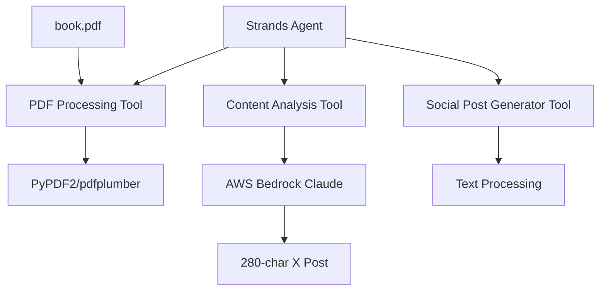

# Design Document

## Overview

The PDF-to-Social-Post application is built using the AWS Strands framework, leveraging its agent-based architecture to create an intelligent system that processes PDF content and generates social media posts. The application combines PDF processing capabilities with AWS AI services to extract meaningful content and transform it into engaging social media posts.

The system operates as a Strands agent with custom tools for PDF processing, content analysis, and social media post generation. It utilizes AWS Bedrock for LLM capabilities and integrates with the existing Strands ecosystem.

## Architecture

### High-Level Architecture



### Component Interaction Flow

1. **Agent Initialization**: Strands agent loads with custom PDF processing tools
2. **Random Page Selection**: PDF tool randomly selects a starting page
3. **Content Extraction**: Extract text from selected pages (2-4 pages)
4. **Content Analysis**: Send extracted text to AWS Bedrock for analysis
5. **Post Generation**: Generate concise social media post from analysis
6. **Output**: Return formatted 280-character post

## Components and Interfaces

### 1. PDF Processing Tool (`pdf_processor`)

**Purpose**: Handle PDF file operations and text extraction

**Interface**:
```python
@tool
def pdf_processor(start_page: int = None) -> dict:
    """
    Extract text from random pages in book.pdf
    
    Args:
        start_page: Optional specific page to start from
        
    Returns:
        dict: {
            'pages_read': [page_numbers],
            'extracted_text': str,
            'total_pages': int
        }
    """
```

**Implementation Details**:
- Uses `PyPDF2` or `pdfplumber` for PDF text extraction
- Implements random page selection algorithm
- Handles edge cases (near end of document)
- Validates PDF file existence and readability

### 2. Content Analysis Tool (`content_analyzer`)

**Purpose**: Analyze extracted text using AWS Bedrock LLM

**Interface**:
```python
@tool
def content_analyzer(text_content: str) -> dict:
    """
    Analyze text content to extract key themes and messages
    
    Args:
        text_content: Raw text from PDF pages
        
    Returns:
        dict: {
            'core_themes': List[str],
            'key_message': str,
            'context_summary': str
        }
    """
```

**Implementation Details**:
- Integrates with AWS Bedrock using strands_tools.use_aws
- Uses Claude model for content analysis
- Implements prompt engineering for theme extraction
- Handles API rate limiting and error responses

### 3. Social Post Generator Tool (`post_generator`)

**Purpose**: Generate 280-character social media posts

**Interface**:
```python
@tool
def post_generator(analysis_result: dict) -> str:
    """
    Generate social media post from content analysis
    
    Args:
        analysis_result: Output from content_analyzer
        
    Returns:
        str: 280-character social media post
    """
```

**Implementation Details**:
- Uses AWS Bedrock for post generation
- Implements character counting and validation
- Ensures engaging and coherent messaging
- Handles post optimization for social media

### 4. Main Agent Orchestrator

**Purpose**: Coordinate the entire workflow

**Interface**:
```python
def generate_social_post() -> str:
    """
    Main workflow orchestrator
    
    Returns:
        str: Final social media post
    """
```

## Data Models

### PDF Content Model
```python
@dataclass
class PDFContent:
    pages_read: List[int]
    extracted_text: str
    total_pages: int
    file_path: str
```

### Content Analysis Model
```python
@dataclass
class ContentAnalysis:
    core_themes: List[str]
    key_message: str
    context_summary: str
    confidence_score: float
```

### Social Post Model
```python
@dataclass
class SocialPost:
    content: str
    character_count: int
    themes_used: List[str]
    generation_timestamp: datetime
```

## Error Handling

### PDF Processing Errors
- **File Not Found**: Clear error message with file path
- **Corrupted PDF**: Graceful fallback with error reporting
- **Empty Pages**: Skip and try adjacent pages
- **Permission Errors**: Handle file access issues

### AWS Service Errors
- **Authentication Failures**: Clear AWS credential guidance
- **Rate Limiting**: Implement exponential backoff
- **Service Unavailable**: Retry logic with fallback
- **Invalid Responses**: Response validation and error handling

### Content Processing Errors
- **Empty Content**: Handle cases with no extractable text
- **Character Limit Exceeded**: Automatic truncation with preservation of meaning
- **Invalid Analysis**: Fallback to simpler content extraction

## Testing Strategy

### Unit Tests
- **PDF Processing**: Test with various PDF formats and edge cases
- **Content Analysis**: Mock AWS responses for consistent testing
- **Post Generation**: Validate character limits and content quality
- **Error Handling**: Test all error scenarios

### Integration Tests
- **End-to-End Workflow**: Complete pipeline testing
- **AWS Integration**: Test with actual AWS services
- **File System Integration**: Test with real PDF files

### Performance Tests
- **PDF Processing Speed**: Measure extraction performance
- **AWS API Latency**: Monitor response times
- **Memory Usage**: Test with large PDF files

## Security Considerations

### AWS Credentials
- Use IAM roles and policies for least privilege access
- Secure credential storage and rotation
- Environment variable configuration

### Data Privacy
- No persistent storage of PDF content
- Secure handling of extracted text
- Compliance with data retention policies

### Input Validation
- PDF file validation and sanitization
- Content filtering for inappropriate material
- Rate limiting for API calls

## Configuration

### Environment Variables
```bash
AWS_REGION=us-west-2
AWS_PROFILE=default
BEDROCK_MODEL_ID=anthropic.claude-3-sonnet-20240229-v1:0
PDF_FILE_PATH=book.pdf
MAX_PAGES_TO_READ=3
```

### AWS Services Required
- **AWS Bedrock**: For LLM capabilities
- **IAM**: For access management
- **CloudWatch**: For logging and monitoring

## Dependencies

### Python Packages
- `strands-agents`: Core framework
- `strands-agents-tools`: AWS integration
- `PyPDF2` or `pdfplumber`: PDF processing
- `boto3`: AWS SDK
- `dataclasses`: Data modeling

### AWS Resources
- Bedrock model access (Claude 3 Sonnet)
- Appropriate IAM permissions
- CloudWatch logging (optional)